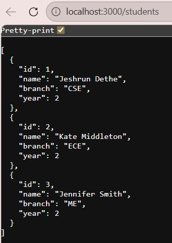
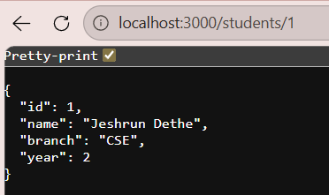

# Exp-6 – Student Records REST API

A simple RESTful API built with **Node.js + Express** to manage student records.

---

## 📁 Project Structure

```
student-api/
├── index.js        ← main server file (all your code lives here)
└── package.json    ← project config + scripts
```

---

## ⚙️ Setup & Run

```bash
# 1. Install dependencies
npm install

# 2. Start server with nodemon (auto-restarts on file save)
npm run dev

# OR start normally (no auto-restart)
npm start
```

Server runs at → **http://localhost:3000**

---

## 🔗 API Endpoints

| Method | Endpoint      | What it does           |
| ------ | ------------- | ---------------------- |
| GET    | /students     | Get all students       |
| GET    | /students/:id | Get one student by ID  |
| POST   | /students     | Add a new student      |
| PATCH  | /students/:id | Update student details |
| DELETE | /students/:id | Delete a student       |

---

## OUTPUT

### Get all students (GET    | /students     | Get all students )



### Get student with ID 1 (GET    | /students/:id | Get one student by ID)



### Add a new student ( POST   | /students     | Add a new student )


### Update a student (only send fields you want to change)

```bash
curl -X PATCH http://localhost:3000/students/1 \
  -H "Content-Type: application/json" \
  -d '{"year": 3}'
```

### Delete a student

```bash
curl -X DELETE http://localhost:3000/students/2
```

---

## 📦 Packages Used

| Package | Purpose                              |
| ------- | ------------------------------------ |
| express | Web framework – handles routes       |
| morgan  | Logs each HTTP request in terminal   |
| nodemon | Auto-restarts server on file changes |


